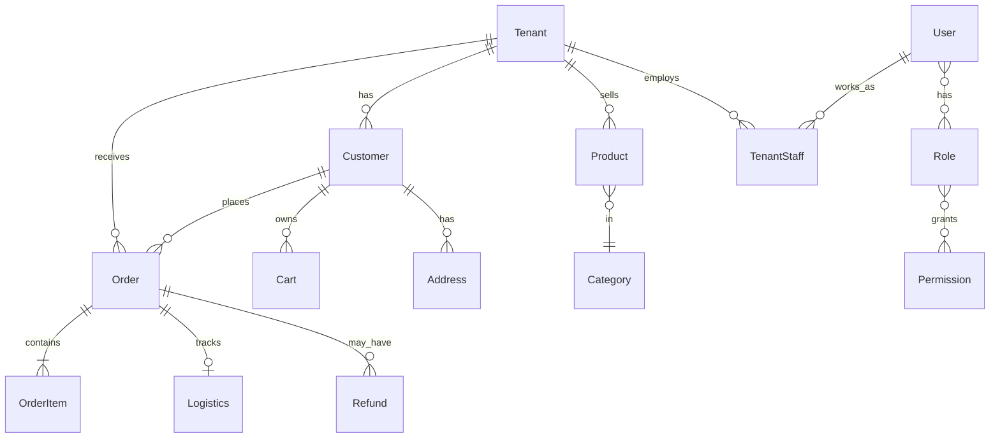

# 数据库设计

> 面向：后端开发人员  
> 模型源码：`adminAPI/**/models.py`（共 26 个 app，约 72 张业务表）

---

## 1. ER 关系概览



**中心实体**

- **Tenant**：多租户店铺，关联商品、订单、商家员工、评分、国补等
- **Customer**：商城买家，关联订单、购物车、积分、会员、评价
- **User**：平台/商家后台员工，RBAC + 审核 + 客服
- **Order**：串联商品行、物流、售后、国补、拼团、优惠券

---

## 2. 按 App 分表说明

> 默认表名：`{app_label}_{model_name}`，除非模型 Meta 指定 `db_table`。

### accounts

| 模型 | 表名 | 关键字段 |
|:---|:---|:---|
| Department | accounts_department | name, code, parent_id, manager_id→User |
| User | accounts_user | username, phone, department_id, supervisor_id |
| ActivationLog | accounts_activation_log | user_id, token, status, expired_at |

### customers

| 模型 | 表名 | 关键字段 |
|:---|:---|:---|
| Customer | customers_customer | phone, nickname, tenant_id, level, points, is_active |
| SmsVerificationCode | customers_sms_code | phone, code, scene, expires_at |

唯一约束：`(tenant, phone)`

### products

| 模型 | 表名 | 关键字段 |
|:---|:---|:---|
| Category | products_category | parent_id, name, sort_order |
| Brand | products_brand | name, logo_url |
| Product | products_product | category_id, brand_id, tenant_id, price, stock, status |
| InventoryLog | products_inventory_log | product_id, change_type, before/after_quantity |

### orders

| 模型 | 表名 | 关键字段 |
|:---|:---|:---|
| Order | orders_order | order_no, customer_id, tenant_id, total_amount, status |
| OrderItem | orders_order_item | order_id, product_id, quantity, unit_price |
| Refund | orders_refund | order_id, amount, status |
| CancelLog | orders_cancel_log | order_id, action, operator_type |

### cart / addresses

| 模型 | 表名 | 关键字段 |
|:---|:---|:---|
| Cart | cart_cart | customer_id, tenant_id |
| CartItem | cart_cart_item | cart_id, product_id, quantity, selected |
| Address | addresses_address | customer_id, province/city/district/detail, is_default |

### promotion

| 模型 | 说明 |
|:---|:---|
| SeckillActivity | 秒杀活动，M2M products |
| GroupBuyActivity / GroupOrder | 拼团 |
| Coupon / UserCoupon | 优惠券领取与使用 |
| SuperDiscount | 平台超级折扣 |

### points / membership / seller_points

| 模型 | 说明 |
|:---|:---|
| PointsAccount / PointsTransaction / PointsRule | 平台积分 |
| MemberLevel / MemberProfile / GrowthLog | 会员等级 |
| SellerPointsRule / SellerPointsAccount | 商家店铺积分 |

### tenants

| 模型 | 说明 |
|:---|:---|
| Tenant | 店铺主体，status、config(JSON) |
| TenantStaff | user↔tenant，role |
| TenantAppeal / TenantInboxMessage | 申诉与站内信 |
| TenantChangeLog | 资料变更待审 |

### chat / complaints / notification / approval

| 模型 | 说明 |
|:---|:---|
| Conversation / Message | 客服会话 |
| Complaint / ComplaintMessage | 投诉工单 |
| Notification | 站内通知（recipient_type + recipient_id） |
| Approval / ApprovalLog | 统一审核 |

### tag_system / subsidy / shop_closure / shop_rating

| 模型 | 说明 |
|:---|:---|
| Tag / TagCategory / TenantTagConfig / ProductTagConfig | 促销标签（商品最多 3 个活跃标签） |
| SubsidyPolicy / SubsidyProduct / SubsidyOrder | 国补 |
| ClosureApplication | 店铺注销 |
| ShopRating / UserRating | 店铺与用户评分 |

### rbac / system / audit

| 模型 | 说明 |
|:---|:---|
| Permission / Role / Menu | RBAC |
| SystemSetting | key-value 系统配置 |
| OperationLog | 操作审计 |

---

## 3. 索引与约束（要点）

- **Customer**：`(tenant_id, phone)` 唯一
- **Cart**：`(customer_id, tenant_id)` 唯一
- **PointsAccount / SellerPointsAccount**：`(customer, tenant)` 唯一
- **ProductTagConfig**：`(product, tag)` 唯一
- 订单号 `order_no` 业务唯一（模型层保证）
- 外键删除策略以 models 中 `on_delete` 为准（多数 CASCADE / SET_NULL）

---

## 4. 迁移管理

```powershell
cd adminAPI
python manage.py makemigrations
python manage.py migrate
python manage.py showmigrations
```

初始化数据：

```powershell
python manage.py init_data      # RBAC + 演示账号
python manage.py sync_menus     # 菜单同步
python manage.py seed_test_data # 测试种子（可选）
```

v1.0.0 重要迁移见 [Baseline](../06-项目交付/Baseline-v1.0.0.md) §7。

---

## 5. reports 模块

`reports` **无 Django Model**，报表由视图层聚合查询生成。

---

## 相关文档

- [架构设计](架构设计.md)
- [接口文档](接口文档.md)
- [Baseline v1.0.0](../06-项目交付/Baseline-v1.0.0.md)
